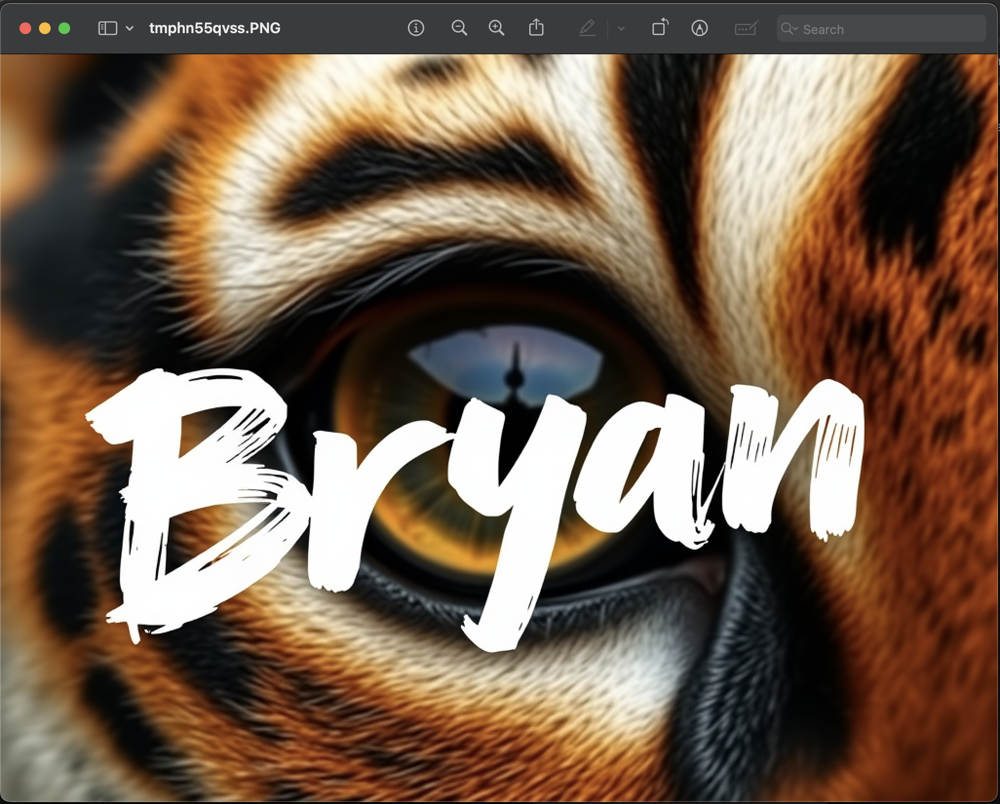

# Image Generation Script

This script allows users to generate images using different models from `fal-ai` by selecting a model and providing a custom prompt. The generated image is then displayed automatically.

## Requirements

Ensure you have the following dependencies installed before running the script:

```sh
pip install requests Pillow fal-client
```

## Usage

Run the script and follow the on-screen prompts:

```sh
python main.py
```

### Options:
- Select an image generation model:
  - `1`: `fal-ai/flux-pro/v1.1`
  - `2`: `fal-ai/flux/dev`
  - `3`: `fal-ai/flux/schnell`
  - `4`: Exit the program
- Enter a text prompt to generate an image.

## Features
- Allows users to choose from three different AI models.
- Accepts a user-defined prompt for image generation.
- Retrieves the generated image and displays it automatically.

## Example image
```sh
Select an image generation model:
1. fal-ai/flux-pro/v1.1
2. fal-ai/flux/dev
3. fal-ai/flux/schnell
4. Exit
Enter the number of your choice: 1
Enter your prompt for image generation: Extreme close-up of a single tiger eye, direct frontal view. Detailed iris and pupil. Sharp focus on eye texture and color. Natural lighting to capture authentic eye shine and depth. The word "Bryan" is painted over it in big, white brush strokes with visible texture.
```

## Notes
- The generated images are retrieved via a URL and displayed using the `Pillow` library.
- Ensure you have an active internet connection for image retrieval.

## Example
